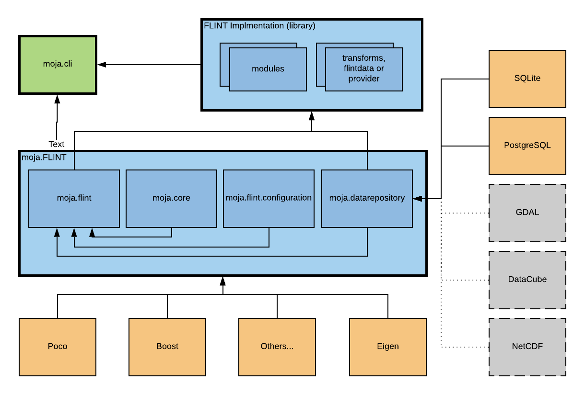
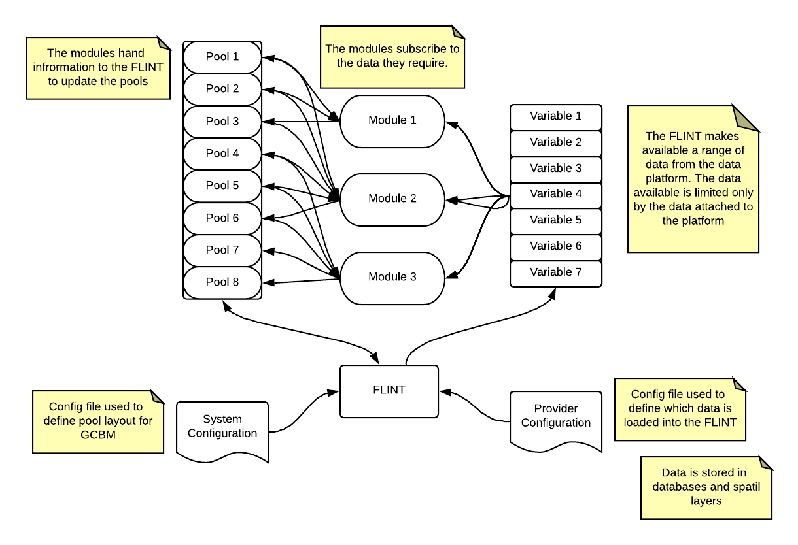
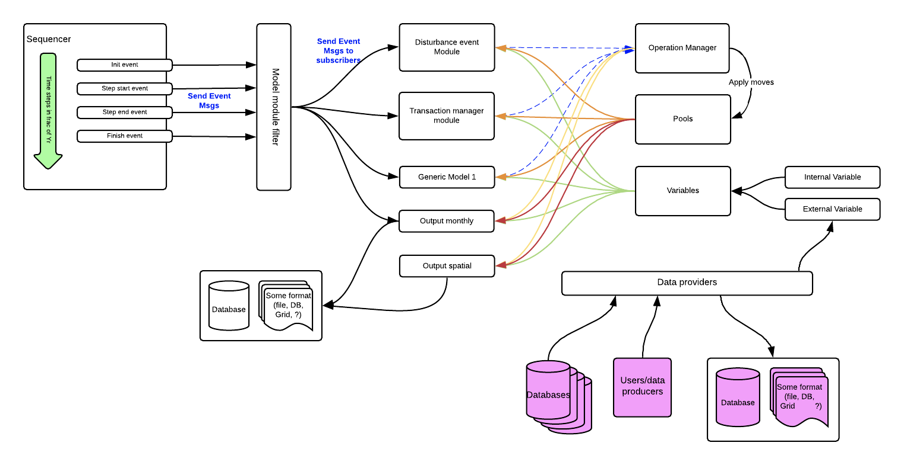

# FLINT
## Introduction
The architecture of the FLINT is reasonably simple. It’s written in C++ and currently compiles on both Windows and Ubuntu. The base library structure allows a user to build Modules, Transforms, FLINTData and Providers, and attach these through json configuration files - loading dynamically at runtime.

Core Framework Layout

Simple Diagram of Components

## Key Components
Key components of the FLINT system are:

- Local Domain Controller (LDC - LocalDomainControllerBase)
    - Handles the iteration of the Land Unit’s intended for simulation.
    - Including calling the configured Sequencer
    - System Spatial LDC: `SpatialTiledLocalDomainController`
    - System Point LDC: `LocalDomainControllerBase`
    - Built into the moja CLI program
    - Users can run default `moja.cli.mulliongroup` (.exe on windows) or create their own
- Notification Center (NotificationCenter)
    - Used to control FLINT System events.
    - Data member of the LDC
    - Events are fired using the method "`postNotification`" and a System Event Type (see signals.h)
- Sequencer (SequencerModuleBase)
    - Called by the LDC, handles iterations (other than location, i.e. date) for each LU.
    - Commonly time (i.e. Yearly, Monthly, Daily, etc)
    - Each Sequence will fire predefined FLINT System Events (InitTiming, TimingStep, etc). These events can be subscribed to by Modules.
    - For Disturbance event handling see: `CalendarAndEventFlintDataSequencer`
        - Allows events to be defined and processed mid step.
        - Any step with an Event will be broken into 2 or more segments, with Pool moves being proportioned appropriately.
        - **[Insert Diagram Perhaps]** 
        - See [chapman richards](https://github.com/moja-global/FLINT.Example/tree/master/Source/moja.modules.chapman_richards) example of event handling
        - In [Build Land Unit module](https://github.com/moja-global/FLINT.Example/blob/master/Source/moja.modules.chapman_richards/src/buildlandunitmodule.cpp), populating the event queue
- Providers (IProviderInterface)
    - Defined datasets that allow the FLINT to access input data sources such as Relational Databases, Spatial Data, etc.
    - Defined interface allows location lookup of data when running spatially - Lat & Lon.
    - Various base types of Providers exist to define interfaces available:
       - IProviderNoSQLInterface
       - IProviderRelationalInterface
       - IProviderSpatialRasterStackInterface
       - IProviderSpatialRasterInterface 
       - IProviderSpatialVectorInterface
- Operation Manager (IOperationManager)
    - This component manages operations created on Pools. Designed to enable Mass Balance and allows fluxes to be timed according to Steps and User preference (i.e. immediately or the end of each timing step). See System Modules:
        - `TransactionManagerEndOfStepModule`
        - `TransactionManagerAfterSubmitModule`
    - These modules make calls on the Operations Manager to apply registered Operations, but at different times. FullCAM for example will process all operations at the end of each step, GCBM will do them immediately after being submitted.
    - The timing change has the following effects:
        - Might need to get Max and malcolm.francis@mulliongroup.com to add comments here (see below).
    - Different implementations can be created. Using different methods to make the movements between Pools. For example, using Matrix tools (i.e. EIGEN) or a simple list method (`OperationManagerSimple`).
    - Operation types are: 
        - Stock - move explicit amounts between specified Pools
        - Proportional - move a proportion between specified Pools

---
  
Comments from Max Fellows: Different sets of science modules have different needs in terms of when the carbon transfers get applied because it affects the view that the modules have of the carbon pools. GCBM is a long chain of mostly sequential modules, so we use TransactionManagerAfterSubmitModule which applies the pool operations after every single event the system fires (actually we're a little bit paranoid about this, so we often manually apply them in the science modules too) - we want to ensure that all of our modules are looking at the most current pool values, because some of our modules use them to inform the next movements of carbon. Other sets of modules might be more simultaneous - that is, they set up a bunch of proportional operations based on the pool values at the beginning of the timestep, then they all get applied at once. It's also possible to manage this entirely in the science modules - these are really just helpers. Long story short: TransationManagerAfterSubmitModule is in there mainly for GCBM, pretty much everything else should be using TransactionManagerEndOfStepModule.Now that I look at this stuff again, GCBM would probably blow up if line 20 of AfterSubmitModule ever got uncommented

---

- Modules (ModuleBase)
    - Both internal FLINT and custom modules
    - Attached to a 0 or Many FLINT Events that are fired by the LDC or Sequencer
    - Can interact with Pools and Variables and use Provider Data
- Common Data: Pools (IPool)
    - Single set of Pool values shared across all Land Units
    - Can be reset at various stages
    - Can be Viewed and modified at various time - used to do Pool reporting
    - Defined interface in interactions - allows mass balance to be maintained
    - Pools can report more than Carbon - simply a bucket with a Floating Point number, that modules can make moves to and from
- Common Data: Variables (IVariable)
    - Used by the Modules to store data they may need to share with the implementation (other Modules).
    - For example: **Boolean**: TreeExists would be a boolean to tell other Modules that a tree has been planted.
    - Variables can also be `moja::flint::ITransform` or `moja::flint::IFlintData`
    - Transforms allow the system to replace a variable value with a value returned by the Transform - hence calling code that can make calculations and access current Pool, Variable and Provider values.
    - For example: accessing a Spatial Layer from a Provider would automatically get the data for the current Lat & Lon
    - FlintData allows for a more complex data structure that can be shared across Modules. Giving more than just the single value() returned by a Transform.

Not completely accurate, but an indication of how the system is trying to process

## FLINT System Events
The core LDC and Sequencer, and custom systems develop, should fire a sequence of FLINT system events to enable attached Modules to do their work and the required times. The FLINT System Events are defined in ***signals.h***. Events are fired by using the method "`postNotification`" defined in the Notification Center (`NotificationCenter`). 

| Event (moja::signals)             |     Calling Component     | Description |
|-----------------------------------|:-------------------------:|:-----------:|
| SystemInit                        | Controlling program (CLI) |             |
| SystemShutdown                    | Controlling program (CLI) |             |
| LocalDomainInit                   |            LDC            |             |
| LocalDomainShutdown               |            LDC            |             |
| LocalDomainProcessingUnitInit     |            LDC            |             |
| LocalDomainProcessingUnitShutdown |            LDC            |             |
| PreTimingSequence                 |            LDC            |             |
| TimingInit                        |         Sequencer         |             |
| TimingPrePostInit                 |         Sequencer         |             |
| TimingPostInit                    |         Sequencer         |             |
| TimingPostInit2                   |         Sequencer         |             |
| TimingShutdown                    |         Sequencer         |             |
| TimingStep                        |         Sequencer         |             |
| TimingPreEndStep                  |         Sequencer         |             |
| TimingEndStep                     |         Sequencer         |             |
| TimingPostStep                    |         Sequencer         |             |
| OutputStep                        |         Sequencer         |             |
| Error                             |          Anywhere         |             |
| DisturbanceEvent                  |         Sequencer         |             |
| PrePostDisturbanceEvent           |         Sequencer         |             |
| PostDisturbanceEvent              |         Sequencer         |             |
| PostDisturbanceEvent2             |         Sequencer         |             |
| PostNotification                  |          Anywhere         |             |
| Unknown                           |            N/A            |             |

`moja::signals::postNotification`

## System Description

### SOME WORK TO DO ON THIS SECTION, BUT SHOULD GIVE A ROUGH IDEA

The ultimate purpose of the FLINT framework is to enable the tracking of defined Pool values and report the values over a sequence of some kind (i.e. Daily, Monthly, Yearly), and possibly a spatial area of interest.

The framework, using the CLI program, can be configured and run using JSON configuration files. The main configuration file allow the user to defined some of the following things: Point or Spatial Simulation, a Sequencer to use (for timing, i.e. Monthly or Yearly steps, etc), Operations Manager to use (changes how Pool moves are calculated), Pools to track, Variables to share between system components (including Transforms & FLINT Data objects). The provided configuration allows various data sources to be defined. These Sources can be location aware (when running over a spatial area of interest).

The modelling mainly consists of moving values from Pool to Pool over a sequence of some kind. Recording these pool moves, both static Values of the Pool and the Flux (timing, Source Pool, Sink Pool & Value).

A simple example of this would be a monthly sequencer with the standard LDC running on Point mode (non - spatial). As it’s a point Simulation it will not iterate over a landscape.  We could connect the RothC modules and give a date range to run from (1/1/2000 - 31/12/2010).

Once run the LDC will see that a Point sim is being run, dynamically load the Modules defined and reset Pool and Variable values as required. 

Then Doing the system startup various system Events are fired, then the defined sequence is run. It will fire various system Events - which the attached Modules will catch and do their processing: Pool moves and recording Pool moves. 

At the end of the sequencer - the LDC will take control and fire System Events to wrap up. Modules that write the Fluxes and Pool values to file or database could be called at this stage. Assuming they weren’t streamed during processing.

