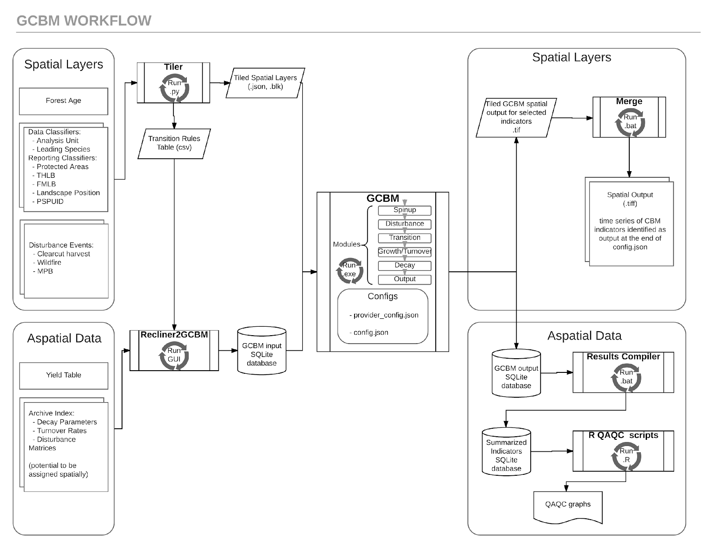

# GCBM Module

The GCBM (Generic Carbon Budget Model) is a combination of the FLINT platform with the science modules developed by the Canadian Forest Service (CFS).

These are the same science modules used in the first generation tool ([CBM-CFS3](https://www.nrcan.gc.ca/climate-change/impacts-adaptations/climate-change-impacts-forests/carbon-accounting/carbon-budget-model/cbm-cfs3/13089)). Since the science and processes behind both tools are very similar, it is relatively easy to transition from CBM-CFS3 to GCBM.

The CBM-CFS3 is widely used throughout Canada and globally and its use is supported by the Canadian Forest Service of Natural Resources Canada.

The next generation GCBM is currently used by the CFS with a number of partner organizations to advance the science of forest carbon estimation and to support policy analyses such as the assessment of mitigation options in the forest sector.

In GCBM, forest inventory and disturbance events are spatially explicit. The location of disturbances are explicit in spatial layers instead of rule based. The GCBM Module is able to simulate large landscapes easily.

